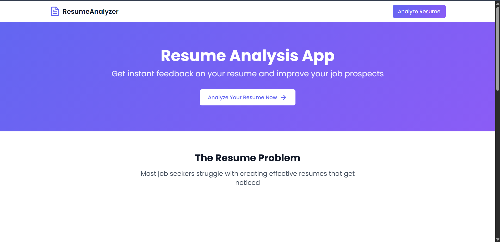

# 📄 Professional Resume Analyzer 🚀

[](https://nodejs.org/)  
[](https://github.com/yogender-kumar-creator/-Professional-Resume-Analyzer-)  
[]()

---

Welcome to the **Professional Resume Analyzer**!  
This app helps job seekers **polish their resumes** for better chances at landing interviews using **AI-powered insights**.




 <!-- Replace with your actual GIF or image path -->

---

## 🌟 Features

- 📥 **Upload Resumes**: Drag & drop or select PDF resumes easily.  
- 🧠 **AI Analysis**: Analyze resumes for key skills, achievements, and structure.  
- 📊 **Resume Scoring**: Get a comprehensive score (0–100) based on multiple quality metrics.  
- ✅ **Improvement Suggestions**: Identify missing sections and get actionable recommendations.  
- 🎯 **Skill Highlighting**: Highlight both technical and soft skills automatically.  
- 📝 **Professional Summary**: Generate an AI-powered professional summary.  
- 📥 **Download Reports**: Export detailed JSON reports for deeper insights.  
- 🎨 **Modern UI**: Clean, interactive interface built with **Tailwind CSS** and animations.

---

## ⚙️ Setup & Installation

1. **Clone the repository**  
```bash
git clone https://github.com/yogender-kumar-creator/-Professional-Resume-Analyzer-
cd -Professional-Resume-Analyzer-
